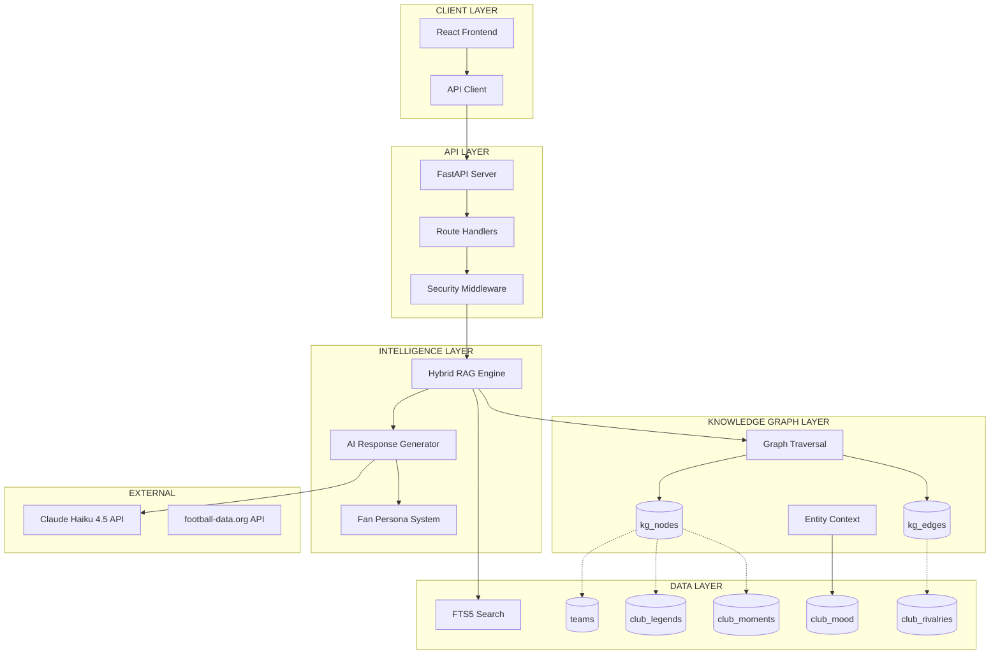
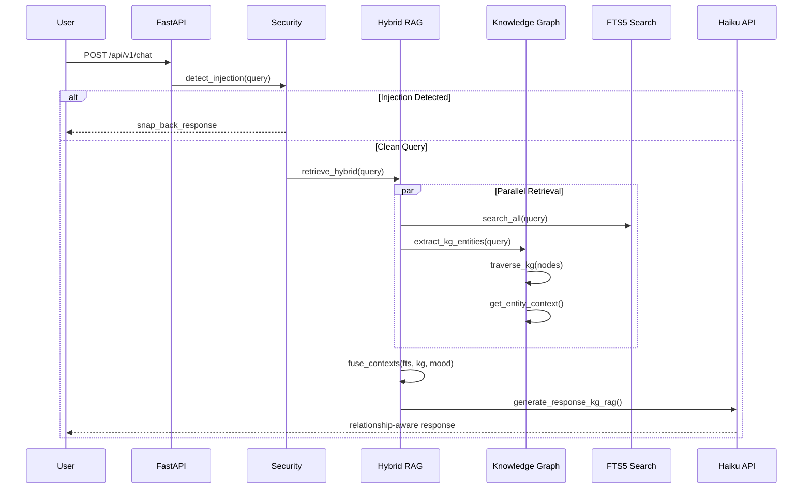
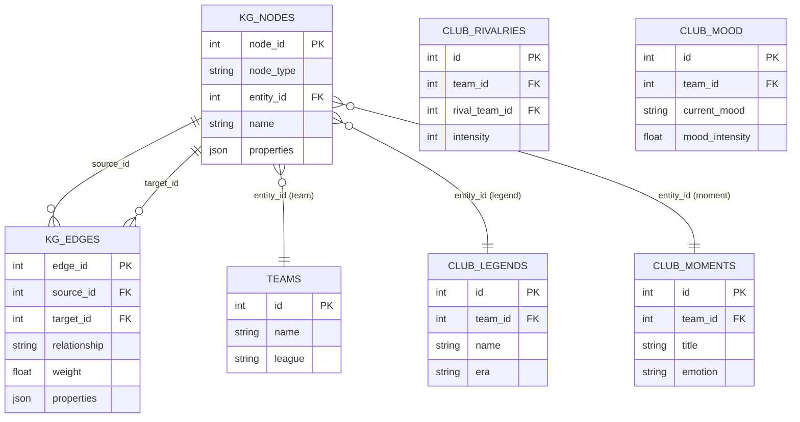
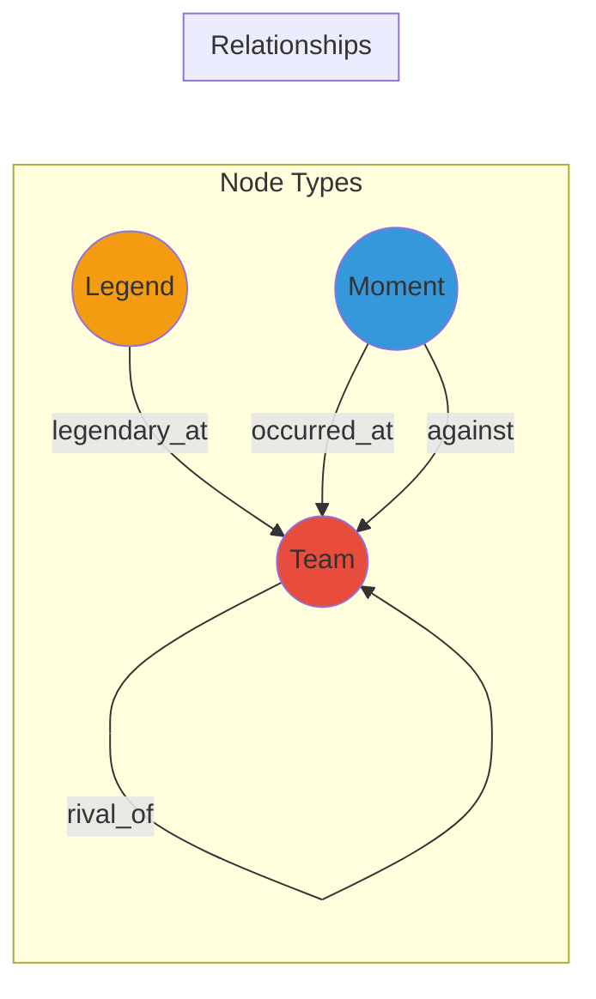
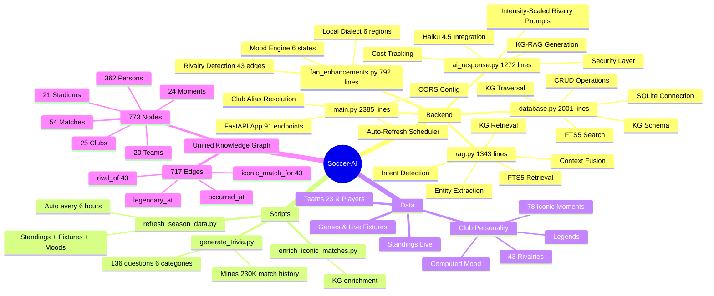
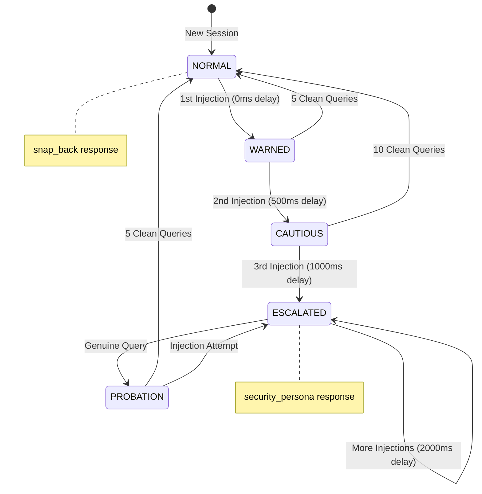
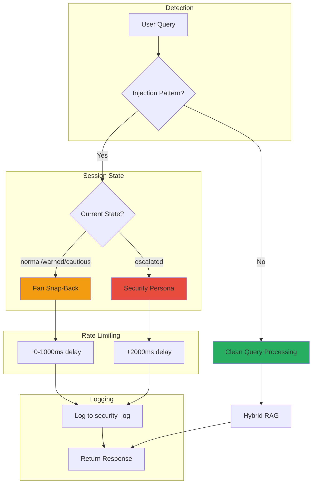
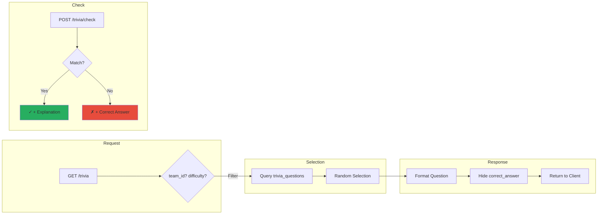
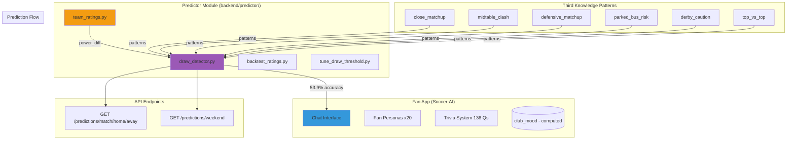

# Soccer-AI System Atlas

## Architecture Overview



## Data Flow: Query to Response



## Knowledge Graph Schema



## Graph Relationship Types



## Module Responsibility Map



## Security Flow (Session-Based Escalation)



## Security Response Types



## Trivia System Flow



## Predictor Integration (IMPLEMENTED)



### Predictor Accuracy Metrics

| Metric | V1 (Tri-Lens) | V2 (DC+BK) |
|--------|--------------|------------|
| Overall Accuracy | 53.2% | **53.9%** |
| Draw Precision | 17.3% | **50.0%** |
| Brier Score | 0.580 | 0.584 |
| Architecture | 55% Poisson + 45% Oracle | **40% Dixon-Coles + 60% Bookmaker** |

### Third Knowledge Pattern Details

| Pattern | Trigger Condition | Draw Boost |
|---------|-------------------|------------|
| `close_matchup` | Power diff < 10 | 1.3x - 1.8x |
| `midtable_clash` | Both teams positions 8-15 | 1.4x |
| `defensive_matchup` | Both teams defensive style | 1.35x |
| `parked_bus_risk` | Big favorite + defensive underdog | 1.25x |
| `derby_caution` | Rivalry match | 1.3x |
| `top_vs_top` | Both in top 6 | 1.25x |

## Gap Tracker Architecture

```mermaid
graph TD
    subgraph "Source Documents"
        DOCS[.md/.ctx files]
        SCHEMA[schema.sql]
        TESTS[test_*.py]
    end

    subgraph "Scanner"
        SCAN[scan_implementation_gaps.py]
        PARSE[Parse TODO/PENDING]
        COMPARE[Compare docs vs main.py]
    end

    subgraph "Database"
        GAPS[(implementation_gaps)]
    end

    subgraph "Admin API"
        GET[GET /admin/gaps]
        UPDATE[POST /admin/gaps/{id}/status]
    end

    DOCS --> SCAN
    SCHEMA --> SCAN
    TESTS --> SCAN
    SCAN --> PARSE
    PARSE --> COMPARE
    COMPARE --> GAPS

    GAPS --> GET
    UPDATE --> GAPS

    style GAPS fill:#e67e22
```

## Current Stats (Updated April 10, 2026)

| Metric | Value |
|--------|-------|
| **Unified KG Nodes** | **773** (362 persons, 54 matches, 25 clubs, 24 moments) |
| **Unified KG Edges** | **717** (43 rivalries, 43 iconic matches) |
| Match History | 230,557 records |
| KB Facts | 681 |
| Fan Personas | **20** (one per Premier League club) |
| Dialect Regions | 6 (Scouse, Geordie, Mancunian, Cockney, Midlands, Neutral) |
| Iconic Matches/Moments | 78 (54 matches + 24 moments) |
| Rivalry Edges | 43 (with intensity weights 0.6-1.0) |
| **Trivia Questions** | **136** (6 categories: records, h2h, history, stats, rivalries, legends) |
| Security States | 5 (normal -> escalated) |
| **Test Cases** | **102** (35 behavioral + 33 integration + 34 KG) |
| **API Endpoints** | **91** (V2 predictions, debate, companion, mood timeline, cards, memories, budget) |
| API Cost/Query | ~$0.002 (Haiku 4.5) |
| **Predictor Accuracy** | **53.9%** (Dixon-Coles + Bookmaker v2) |
| **Draw Precision** | **50.0%** (up from 17.3%) |
| Third Knowledge Patterns | 6 |
| Data Refresh | Auto every 6 hours (football-data.org) |
| **Frontend Pages** | **12** (Games, Table, Clubs, Chat, Predictions, Trivia, Debate, Companion, MoodTimeline, PredictionCard, Demo, TeamDetail) |
| Club Colour Palettes | 20 (dynamic CSS variable theming) |
| Typography | Barlow Condensed + Source Serif 4 + JetBrains Mono |
| Portfolio Demo | /demo — 7 scenes, zero API calls, keyboard navigation |
| Fan Debate Mode | /debate -- two personas argue, 1-5 rounds |
| User Fan Memories | Auto-detected in chat, recalled in future conversations |
| Predictor Explainability | Fan weaves Dixon-Coles data naturally into responses |
| Kinetic Theming | Mood-responsive CSS: rain for despair, glow for euphoria |
| 4D Radar Visualizer | SVG diamond radar in chat header + Demo page |
| Shareable Cards | /card/:home/:away with AI take + verbalogix.com branding |

## File Structure

```
soccer-AI/
├── CLAUDE.md                    # Project instructions
├── README.md                    # Quick start guide
├── schema.sql                   # Database schema
├── api_design.md               # API specification
├── docs/
│   ├── ARIEL_FULL_STORY.md              # Original vision document
│   ├── SOCCER_AI_SYSTEM_ATLAS.md        # This file
│   ├── API_CONTRACTS.md                 # Full API specification
│   ├── architecture/                    # 4D Persona Architecture spec
│   └── arxiv/                           # arXiv paper
├── backend/
│   ├── main.py                 # FastAPI app (3368 lines, 91 endpoints)
│   ├── database.py             # DB + KG layer (2001 lines)
│   ├── rag.py                  # Hybrid RAG (1343 lines)
│   ├── ai_response.py          # AI generation + rivalry scaling (1272 lines)
│   ├── fan_enhancements.py     # Mood, rivalry, dialect (792 lines)
│   ├── config.py               # 4D Persona feature flag
│   ├── persona_bridge.py       # 4D integration layer
│   ├── live_football_provider.py # Live data -> 4D state
│   ├── models.py               # Pydantic models
│   ├── security_session.py     # Injection protection
│   ├── conversation_intelligence.py # Conversation enrichment
│   ├── rate_limiter.py          # Per-IP rate limits + budget cap
│   ├── live_companion.py        # Match day poller + fan reactions
│   ├── requirements.txt        # Python dependencies
│   ├── .env.example            # Environment variable template
│   ├── Dockerfile              # Docker config for Fly.io
│   ├── fly.toml                # Fly.io deployment config
│   ├── soccer_ai.db            # Main database (gitignored)
│   ├── unified_soccer_ai_kg.db # Unified KG 41.8 MB (gitignored)
│   ├── scripts/
│   │   ├── refresh_season_data.py  # Auto-refresh (every 6h)
│   │   ├── generate_trivia.py      # Trivia from match DB
│   │   └── enrich_iconic_matches.py # KG enrichment
│   ├── predictor/              # Match prediction module
│   │   ├── prediction_engine.py    # Main engine
│   │   ├── dixon_coles.py          # V2: Dixon-Coles + Bookmaker ensemble
│   │   ├── tri_lens_predictor.py   # V1: Tri-Lens fusion (legacy)
│   │   ├── hybrid_oracle.py        # ELO + Pattern hybrid
│   │   ├── poisson_predictor.py    # Poisson xG model
│   │   ├── team_ratings.py         # ELO power ratings
│   │   ├── draw_detector.py        # 6 Third Knowledge patterns
│   │   └── backtest_ratings.py     # Validation framework
│   ├── kg/                     # Knowledge graph modules
│   ├── tests/                  # 102 tests (35+33+34)
│   │   ├── test_4d_behavioral.py   # 35 behavioral tests
│   │   ├── test_4d_integration.py  # 33 integration tests
│   │   └── test_kg_migration.py    # 34 KG migration tests
│   └── test_*.py               # Legacy test files
├── frontend/                   # React 19 + Vite 7 + Tailwind (Matchday Programme)
│   ├── src/
│   │   ├── App.tsx
│   │   ├── pages/              # 8 pages
│   │   │   ├── Dashboard.tsx, Standings.tsx, Teams.tsx, TeamDetail.tsx
│   │   │   ├── Chat.tsx        # Fan chat with club theming
│   │   │   ├── Trivia.tsx      # 136-question trivia game
│   │   │   ├── Debate.tsx      # Two-persona debate mode
│   │   │   ├── Predictions.tsx  # All fixtures with Dixon-Coles predictions
│   │   │   ├── Companion.tsx   # Match Day Live Companion
│   │   │   ├── MoodTimeline.tsx # Season Mood Timeline (pure SVG)
│   │   │   ├── PredictionCard.tsx # Shareable prediction card
│   │   │   └── Demo.tsx        # Portfolio guided tour (no API)
│   │   ├── components/Teams/
│   │   │   └── FourDRadar.tsx  # 4D SVG radar visualizer
│   │   ├── config/
│   │   │   ├── clubThemes.ts   # 20 club colour palettes
│   │   │   ├── ClubThemeProvider.tsx # Global theme context
│   │   │   └── theme.ts        # Base theme + typography
│   │   ├── components/         # 28 UI components
│   │   ├── hooks/              # 4 custom hooks
│   │   └── services/api.ts     # API client (458 lines)
│   └── package.json
├── robert/                     # Ariel framework data
└── flask-frontend/             # Testing only - ignore
```
