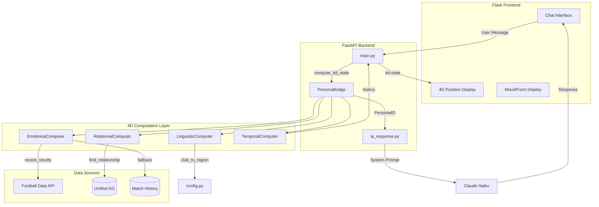
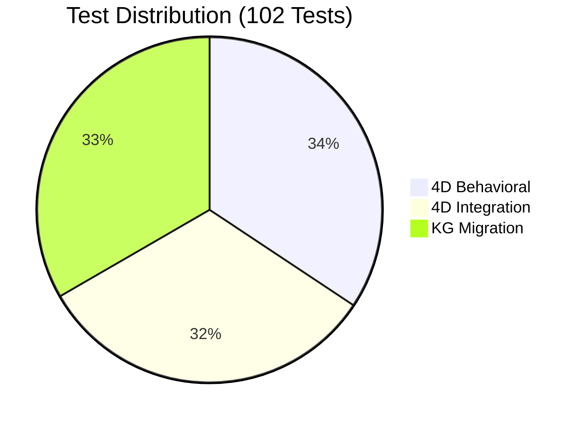

# 4D Persona Architecture Specification

## A Dimensional Model for Embodied AI Agents

**Author**: Eyal Nof  
**Version**: 1.0.0  
**Date**: 28 December 2025

---

## Abstract

This document formalizes a four-dimensional architecture for AI persona systems where the agent's identity is not described but computed as a point (and trajectory) in a 4D space. The dimensions are:

- **X: Emotional** - Affective state derived from real-world data
- **Y: Relational** - Position in a knowledge graph of relationships  
- **Z: Linguistic** - Voice, dialect, and vocabulary identity
- **T: Temporal** - Evolution of the persona through time

Traditional AI personas are static text descriptions. This architecture treats persona as a **dynamic position in dimensional space** that moves based on real data, context, and time.

---

## 1. The Problem with Flat Personas

### 1.1 Static Description Model

Current AI systems define personas through text:

```
System Prompt: "You are a helpful assistant who is enthusiastic about football."
```

This creates several limitations:

| Limitation | Description |
|------------|-------------|
| **Immutability** | The persona never changes regardless of context |
| **Disconnection** | Emotions are performed, not derived from reality |
| **Flatness** | No dimensional variation in response to stimuli |
| **Amnesia** | No memory of persona evolution over time |

### 1.2 The Costume Problem

A static persona is a costume the model wears. It says the right words but doesn't *inhabit* the identity. The model is an actor, not a character.

---

## 2. Dimensional Persona Model

### 2.1 Core Concept

Instead of describing WHO the persona is, we define WHERE the persona is in a 4D space:

```
Persona State P(t) = (x, y, z, t)

Where:
  x ∈ [-1, 1]  : Emotional dimension (negative to positive affect)
  y ∈ Graph    : Relational dimension (position in knowledge graph)
  z ∈ Dialect  : Linguistic dimension (voice/vocabulary space)
  t ∈ Time     : Temporal dimension (when in the persona's timeline)
```

### 2.2 Visual Representation

```
                        LINGUISTIC (z)
                             |
                             |  Identity: "Scouse Liverpool fan"
                             |       /
                             |      /
                             |     * P(t) ← Persona at time t
                             |    /|
                             |   / |
                             |  /  |
                             | /   |
                             |/    |
    EMOTIONAL (x) -----------+-----|---------------- RELATIONAL (y)
        frustrated    neutral|     happy            rivals ← club → legends
                             |
                             |
                           TIME (t)
                             |
                        (into page)
                             |
                        past → present → future
```

The persona is not a description - it's a **point in this space** that moves over time.

### 2.3 Dimension Summary

| Dimension | Input Signal | Computed Output | Example |
|-----------|--------------|-----------------|---------|
| X: Emotional | Real-world metrics | Mood state | Match results → euphoric |
| Y: Relational | KG neighbors | Relationship activation | Rival mentioned → rivalry mode |
| Z: Linguistic | Dialect config | Voice identity | Liverpool → Scouse dialect |
| T: Temporal | Recent events | Memory + trajectory | 3 losses → declining mood |

---

## 3. Dimension Specifications

### 3.1 X-Axis: Emotional Dimension

**Definition**: The affective state of the persona, derived from real-world ground truth data.

**Range**: Continuous scale from -1 (negative) to +1 (positive)

**Computation**:

```python
def compute_emotional_position(entity_id: str) -> EmotionalState:
    """
    Derive emotional position from ground truth data.
    NOT prompted - CALCULATED from reality.
    """
    # Fetch real-world data
    recent_results = database.get_results(entity_id, limit=5)
    
    # Calculate form metrics
    points = sum(result_to_points(r) for r in recent_results)
    max_possible = len(recent_results) * 3
    form_ratio = points / max_possible
    
    # Map to emotional position
    x_position = (form_ratio * 2) - 1  # Scale to [-1, 1]
    
    # Determine discrete mood state
    if x_position > 0.6:
        mood = "euphoric"
    elif x_position > 0.2:
        mood = "confident" 
    elif x_position > -0.2:
        mood = "neutral"
    elif x_position > -0.6:
        mood = "anxious"
    else:
        mood = "frustrated"
    
    return EmotionalState(
        x=x_position,
        mood=mood,
        intensity=abs(x_position),
        reason=generate_reason(recent_results),
        grounded_in=recent_results  # Provenance
    )
```

**Key Properties**:
- Derived from data, not declared
- Changes automatically when ground truth changes
- Has provenance (can explain WHY this emotion)
- Continuous, not discrete

### 3.2 Y-Axis: Relational Dimension

**Definition**: The persona's position in a knowledge graph of relationships.

**Structure**: Graph space with typed edges

**Computation**:

```python
def compute_relational_position(entity_id: str, context: str) -> RelationalState:
    """
    Determine relational context through graph traversal.
    """
    # Get the entity's neighborhood in the KG
    node = knowledge_graph.get_node(entity_id)
    
    # Detect if context activates any relationships
    activated_edges = []
    for edge in node.edges:
        if edge.target_mentioned_in(context):
            activated_edges.append(edge)
    
    # Determine relational intensity
    if activated_edges:
        primary_relation = max(activated_edges, key=lambda e: e.weight)
        y_position = primary_relation.weight  # e.g., rivalry intensity
        
        return RelationalState(
            y=y_position,
            relation_type=primary_relation.type,  # "rival", "legend", "ally"
            target=primary_relation.target,
            context=primary_relation.metadata,  # banter, history, etc.
            activated=True
        )
    
    return RelationalState(y=0, activated=False)  # Neutral position
```

**Graph Structure**:
```
                    ┌─────────────┐
                    │   LEGEND    │
                    │   (Henry)   │
                    └──────┬──────┘
                           │ LEGENDARY_AT (0.95)
                           ▼
┌─────────────┐    ┌─────────────┐    ┌─────────────┐
│   RIVAL     │◄───│    CLUB     │───►│   MOMENT    │
│ (Tottenham) │    │  (Arsenal)  │    │(Invincibles)│
└─────────────┘    └─────────────┘    └─────────────┘
   RIVAL_OF (1.0)         │            ICONIC_FOR (0.9)
                          │
                          ▼
                   ┌─────────────┐
                   │    MOOD     │
                   │  (anxious)  │
                   └─────────────┘
                   CURRENT_STATE (computed)
```

**Key Properties**:
- Multi-hop reasoning through graph traversal
- Edge weights determine intensity
- Relationships are activated by context, not always present
- Enables reasoning about entities through their connections

### 3.3 Z-Axis: Linguistic Dimension

**Definition**: The voice, dialect, and vocabulary identity of the persona.

**Structure**: Discrete identity clusters with continuous properties

**Computation**:

```python
def compute_linguistic_position(entity_id: str) -> LinguisticState:
    """
    Determine linguistic identity based on entity properties.
    """
    # Get dialect configuration for entity
    dialect = dialect_registry.get(entity_id)
    
    if dialect is None:
        return LinguisticState(z=0, dialect="neutral")
    
    return LinguisticState(
        z=dialect.distinctiveness,  # How different from baseline
        dialect=dialect.name,  # "Scouse", "Geordie", "Cockney"
        vocabulary={
            "replacements": dialect.word_map,      # "good" -> "boss"
            "injections": dialect.phrases,         # "Sound, that!"
            "constraints": dialect.forbidden,      # Never say "soccer"
        },
        voice_instruction=dialect.system_inject   # Prompt addition
    )
```

**Dialect Space**:
```
             Distinctiveness (z)
                    |
                    |   Geordie •
                    |            \
                    |             \
                    |   Scouse •   \
                    |         \     \
                    |          \     \
                    |   Cockney •     \
                    |            \     \
                    |             \     \
    ────────────────┼──────────────•─────────
                    |           Neutral
                    |
```

**Key Properties**:
- Affects HOW things are said, not WHAT is said
- Applied as post-processing or prompt injection
- Maintains consistency across responses
- Can include vocabulary constraints (never say X)

### 3.4 T-Axis: Temporal Dimension

**Definition**: The evolution of the persona through time, creating trajectory rather than position.

**Structure**: Time series of 3D positions with memory and prediction

**Computation**:

```python
def compute_temporal_position(
    entity_id: str,
    conversation_history: List[Turn],
    session_history: List[Session]
) -> TemporalState:
    """
    Determine temporal context and persona trajectory.
    """
    # Current position in 3D space
    current_xyz = (
        compute_emotional_position(entity_id),
        compute_relational_position(entity_id, conversation_history[-1]),
        compute_linguistic_position(entity_id)
    )
    
    # Historical trajectory (where we've been)
    trajectory = []
    for turn in conversation_history:
        past_position = reconstruct_position(entity_id, turn.timestamp)
        trajectory.append(past_position)
    
    # Velocity (how fast is the persona changing)
    if len(trajectory) >= 2:
        velocity = compute_velocity(trajectory[-2], trajectory[-1])
    else:
        velocity = Vector4D(0, 0, 0, 0)
    
    # Predict future position (momentum)
    predicted_next = current_xyz + velocity
    
    return TemporalState(
        t=len(conversation_history),  # Discrete time step
        current=current_xyz,
        trajectory=trajectory,
        velocity=velocity,
        momentum=predicted_next,
        memory=extract_salient_memories(session_history)
    )
```

**Temporal Visualization**:
```
    Emotional (x)
         |
         |    t=0        t=1         t=2         t=3 (now)
         |     •          •           •           •
         |      \        / \         /           /
         |       \      /   \       /           / (predicted)
         |        \    /     \     /           •
         |         \  /       \   /
         |          \/         \ /
    ─────┼───────────•──────────•─────────────────────
         |          t=0.5      t=1.5
         |
```

**Key Properties**:
- Persona is a trajectory, not just a point
- Has velocity (rate of change)
- Has momentum (predicted future state)
- Memory persists across sessions
- Enables "character arc" over time

---

## 4. The 4D Synthesis

### 4.1 Position Computation

At any moment, the persona exists at a specific 4D coordinate:

```python
def compute_persona_position(
    entity_id: str,
    context: str,
    conversation: List[Turn],
    sessions: List[Session]
) -> Persona4D:
    """
    Compute the full 4D position of the persona.
    """
    # Compute each dimension
    emotional = compute_emotional_position(entity_id)
    relational = compute_relational_position(entity_id, context)
    linguistic = compute_linguistic_position(entity_id)
    temporal = compute_temporal_position(entity_id, conversation, sessions)
    
    return Persona4D(
        x=emotional,
        y=relational,
        z=linguistic,
        t=temporal,
        
        # Derived properties
        intensity=compute_overall_intensity(emotional, relational),
        stability=compute_stability(temporal.trajectory),
        authenticity=compute_groundedness(emotional, relational)
    )
```

### 4.2 System Prompt Synthesis

The 4D position is synthesized into a dynamic system prompt:

```python
def synthesize_system_prompt(persona: Persona4D, base_prompt: str) -> str:
    """
    Convert 4D position into executable system prompt.
    """
    prompt_parts = [base_prompt]
    
    # Emotional injection
    prompt_parts.append(f"""
EMOTIONAL STATE (Dimension X):
Current mood: {persona.x.mood.upper()}
Intensity: {persona.x.intensity:.1f}/1.0
Grounded in: {persona.x.reason}

Express this emotion naturally in your responses.
""")
    
    # Relational injection (if activated)
    if persona.y.activated:
        prompt_parts.append(f"""
RELATIONAL CONTEXT (Dimension Y):
Active relationship: {persona.y.relation_type} with {persona.y.target}
Intensity: {persona.y.y:.1f}/1.0
Context: {persona.y.context}

Let this relationship color your response appropriately.
""")
    
    # Linguistic injection
    if persona.z.dialect != "neutral":
        prompt_parts.append(f"""
LINGUISTIC IDENTITY (Dimension Z):
Dialect: {persona.z.dialect}
Voice: {persona.z.voice_instruction}
Vocabulary: Use {persona.z.vocabulary['injections'][:3]}
Constraints: {persona.z.vocabulary.get('constraints', 'None')}
""")
    
    # Temporal injection
    if persona.t.memory:
        prompt_parts.append(f"""
TEMPORAL CONTEXT (Dimension T):
Conversation position: Turn {persona.t.t}
Recent trajectory: {describe_trajectory(persona.t.trajectory)}
Salient memories: {persona.t.memory[:3]}

Maintain continuity with previous states.
""")
    
    return "\n\n".join(prompt_parts)
```

---

## 5. Mathematical Formalization

### 5.1 State Space Definition

```
Let P be the persona state space:

P = E × R × L × T

Where:
  E = [-1, 1] ⊂ ℝ           (Emotional continuum)
  R = (V, E, W)              (Relational graph: vertices, edges, weights)
  L = {l₁, l₂, ..., lₙ}      (Linguistic identity set)
  T = ℕ × H                  (Time step × History)

A persona state p ∈ P is a tuple:
  p = (e, r, l, t)
```

### 5.2 State Transition Function

```
The persona evolves according to:

p(t+1) = f(p(t), c(t), d(t))

Where:
  p(t)  = current persona state
  c(t)  = context at time t (user input, conversation history)
  d(t)  = ground truth data at time t (external world state)

The transition function f is decomposed:

f(p, c, d) = (
    f_e(p.e, d),      # Emotional update from data
    f_r(p.r, c),      # Relational update from context
    f_l(p.l),         # Linguistic (typically stable)
    f_t(p.t, p)       # Temporal update (append to history)
)
```

### 5.3 Trajectory and Velocity

```
Trajectory over window w:
  τ(t, w) = [p(t-w), p(t-w+1), ..., p(t)]

Velocity (rate of change):
  v(t) = p(t) - p(t-1)

Acceleration (change in rate):
  a(t) = v(t) - v(t-1)

Momentum (predicted next state):
  p̂(t+1) = p(t) + v(t)
```

### 5.4 Stability Metric

```
Stability measures how consistent the persona is over time:

stability(τ) = 1 - (σ(τ) / max_deviation)

Where:
  σ(τ) = standard deviation of positions in trajectory
  max_deviation = maximum possible deviation in space

High stability = consistent character
Low stability = erratic behavior (may indicate issues)
```

---

## 6. Implementation Architecture

### 6.1 Component Diagram

```
┌─────────────────────────────────────────────────────────────────────┐
│                         4D PERSONA ENGINE                            │
├─────────────────────────────────────────────────────────────────────┤
│                                                                      │
│  ┌─────────────┐  ┌─────────────┐  ┌─────────────┐  ┌─────────────┐ │
│  │  EMOTIONAL  │  │ RELATIONAL  │  │ LINGUISTIC  │  │  TEMPORAL   │ │
│  │   COMPUTE   │  │   COMPUTE   │  │   COMPUTE   │  │   COMPUTE   │ │
│  │             │  │             │  │             │  │             │ │
│  │ Real data   │  │ KG traverse │  │ Dialect DB  │  │ History DB  │ │
│  │     ↓       │  │     ↓       │  │     ↓       │  │     ↓       │ │
│  │ Form calc   │  │ Edge detect │  │ Voice load  │  │ Trajectory  │ │
│  │     ↓       │  │     ↓       │  │     ↓       │  │     ↓       │ │
│  │ Mood derive │  │ Context get │  │ Vocab map   │  │ Memory get  │ │
│  └──────┬──────┘  └──────┬──────┘  └──────┬──────┘  └──────┬──────┘ │
│         │                │                │                │        │
│         └────────────────┴────────────────┴────────────────┘        │
│                                   │                                  │
│                                   ▼                                  │
│                        ┌──────────────────┐                          │
│                        │   4D SYNTHESIS   │                          │
│                        │                  │                          │
│                        │ Combine all four │                          │
│                        │ dimensions into  │                          │
│                        │ coherent state   │                          │
│                        └────────┬─────────┘                          │
│                                 │                                    │
│                                 ▼                                    │
│                        ┌──────────────────┐                          │
│                        │ PROMPT SYNTHESIS │                          │
│                        │                  │                          │
│                        │ Convert 4D state │                          │
│                        │ to system prompt │                          │
│                        └────────┬─────────┘                          │
│                                 │                                    │
│                                 ▼                                    │
│                        ┌──────────────────┐                          │
│                        │  LLM GENERATION  │                          │
│                        │                  │                          │
│                        │ Generate with    │                          │
│                        │ embodied persona │                          │
│                        └──────────────────┘                          │
│                                                                      │
└─────────────────────────────────────────────────────────────────────┘
```

### 6.2 Data Flow

```
User Input
    │
    ▼
┌─────────────────┐
│ Context Analysis │ ──────────────────┐
└────────┬────────┘                    │
         │                             │
         ▼                             ▼
┌─────────────────┐         ┌──────────────────┐
│ Entity Resolver │         │ Trigger Detector │
│ (Who is this?)  │         │ (Rival mention?) │
└────────┬────────┘         └────────┬─────────┘
         │                           │
         ▼                           │
┌─────────────────────────────────────────────────────┐
│              PARALLEL DIMENSION COMPUTE              │
├─────────────┬─────────────┬─────────────┬───────────┤
│      X      │      Y      │      Z      │     T     │
│  Emotional  │  Relational │  Linguistic │  Temporal │
│             │             │             │           │
│ Query DB    │ Traverse KG │ Load dialect│ Get hist  │
│ Calc form   │ Find edges  │ Get vocab   │ Calc vel  │
│ Derive mood │ Get context │ Set voice   │ Predict   │
└──────┬──────┴──────┬──────┴──────┬──────┴─────┬─────┘
       │             │             │            │
       └─────────────┴─────────────┴────────────┘
                           │
                           ▼
                   ┌───────────────┐
                   │ 4D State p(t) │
                   └───────┬───────┘
                           │
                           ▼
                   ┌───────────────┐
                   │ Synthesize    │
                   │ System Prompt │
                   └───────┬───────┘
                           │
                           ▼
                   ┌───────────────┐
                   │ Traditional   │
                   │ RAG Retrieval │
                   └───────┬───────┘
                           │
                           ▼
                   ┌───────────────┐
                   │ LLM Generate  │
                   │ (Embodied)    │
                   └───────┬───────┘
                           │
                           ▼
                   ┌───────────────┐
                   │ Post-process  │
                   │ (Vocab check) │
                   └───────┬───────┘
                           │
                           ▼
                      Response
```

---

## 7. Comparison with Existing Approaches

| Aspect | Static Persona | RAG | Embodied RAG | 4D Persona |
|--------|---------------|-----|--------------|------------|
| Persona definition | Text description | Text + retrieval | Computed from data | 4D coordinate |
| Emotional state | Declared | Declared | Derived from reality | Derived + trajectory |
| Relationships | None | Retrieved docs | Graph traversal | Graph + activation |
| Voice/dialect | None | None | Applied | Dimensional identity |
| Memory | None | Context window | Session-based | Full trajectory |
| Time awareness | None | None | Implicit | Explicit dimension |
| Predictability | N/A | N/A | N/A | Momentum/prediction |

---

## 8. Applications

### 8.1 Sports Fan Agents (Reference Implementation)
- X: Mood from match results
- Y: Team → Rivals → Legends knowledge graph
- Z: Regional dialect (Scouse, Geordie, etc.)
- T: Season progression, conversation memory

### 8.2 Customer Service Agents
- X: Satisfaction score from real metrics
- Y: Customer → Products → Issues graph
- Z: Brand voice guidelines
- T: Customer relationship history

### 8.3 Educational Tutors
- X: Patience level from student progress
- Y: Student → Topics → Prerequisites graph
- Z: Age-appropriate communication style
- T: Learning trajectory over sessions

**Vignette: Tutor-AI for Marcus**

| Dimension | Signal | State |
|-----------|--------|-------|
| X: Emotional | 3 failed quizzes this week | Patient, encouraging |
| Y: Relational | Struggling with fractions | Fractions → prerequisites activated |
| Z: Linguistic | Age 12, casual setting | Simple language, friendly tone |
| T: Temporal | Improved from 40% to 55% | Momentum positive, celebrate progress |

**Traditional approach**: "Let me explain fractions again. A fraction represents..."

**4D Persona approach** (computed state: patient + progress-aware):

> "Hey Marcus! You know what? Last week you got 4 out of 10 on fractions, and today you got 5.5 out of 10. That's real progress, mate! I can see the multiplication stuff is clicking now. Want to try one more problem together? I think you're closer than you realize."

The tutor's encouragement is *derived* from actual progress data (T), its patience from recent struggles (X), its vocabulary from student profile (Z), and its focus on prerequisites from the knowledge graph (Y).

### 8.4 Game NPCs
- X: Emotional state from game events
- Y: NPC → Factions → Locations graph
- Z: Character voice/accent
- T: Player interaction history

### 8.5 Therapeutic Companions
- X: Supportiveness calibrated to user state
- Y: User → Topics → Coping strategies graph
- Z: Warm, professional therapeutic voice
- T: Treatment progress over time

---

## 9. Future Directions

### 9.1 5D Extension: Social Dimension
A fifth dimension for multi-agent social dynamics:
- Position relative to other agents
- Group membership effects
- Social influence propagation

### 9.2 Learned Trajectories
Using ML to learn optimal trajectories through persona space:
- What paths lead to better outcomes?
- How should personas evolve?

### 9.3 Persona Interpolation
Smoothly blending between persona positions:
- Gradual mood transitions
- Relationship intensity curves

---

## 10. Conclusion

The 4D Persona Architecture represents a paradigm shift from *describing* AI personas to *computing* them. By treating persona as a position in a four-dimensional space (Emotional, Relational, Linguistic, Temporal), we enable:

1. **Grounded emotion** - Feelings derived from real data
2. **Relationship awareness** - Graph-based reasoning about connections
3. **Linguistic identity** - Consistent voice and vocabulary
4. **Temporal continuity** - Memory, trajectory, and prediction

The persona is not a costume the AI wears. It's a position in space that the AI inhabits - one that moves, evolves, and persists through time.

**The AI doesn't play a character. It lives one.**

---

## References

- [To be added: relevant papers on RAG, knowledge graphs, persona design]

---

## Appendix A: Reference Implementation

See: Soccer-AI (companion repository)
- `fan_enhancements.py` - Emotional dimension computation
- `rag.py` - Relational dimension (KG-RAG)
- `ai_response.py` - Synthesis and generation
- `database.py` - Ground truth data access

---

## Appendix B: Glossary

| Term | Definition |
|------|------------|
| **Embodied RAG** | RAG with persona computed from data rather than described |
| **Ground Truth** | Real-world data that determines emotional state |
| **Persona Trajectory** | The path through 4D space over time |
| **Dimensional Synthesis** | Combining all four dimensions into coherent state |
| **Temporal Momentum** | Predicted future persona state based on trajectory |

---

## Appendix C: Soccer-AI Implementation Atlas

### C.1 Implementation Summary Table

| Dimension | Symbol | Data Source | Implementation | Example Output |
|-----------|--------|-------------|----------------|----------------|
| **Emotional** | X | football-data.org API / match_history | `SoccerAIEmotionalComputer.compute()` | `WWDLW → confident` |
| **Relational** | Y | unified_soccer_ai_kg.db edges | `SoccerAIRelationalComputer.compute()` | `"Liverpool" → rivalry mode` |
| **Linguistic** | Z | config.py DIALECT_REGIONS | `SoccerAILinguisticComputer.compute()` | `Man Utd → Mancunian` |
| **Temporal** | T | Conversation history array | `TemporalComputer.compute()` | `Turn 5 → rising momentum` |

### C.2 System Architecture (Mermaid)



### C.3 Key Files Reference

| File | Purpose | Lines |
|------|---------|-------|
| `backend/config.py` | Feature flag, dialect regions | ~50 |
| `backend/live_football_provider.py` | Live API + DB fallback | ~250 |
| `backend/persona_bridge.py` | Main 4D integration, computers | ~450 |
| `backend/main.py` | Chat endpoint (modified) | ~1500 |
| `backend/ai_response.py` | System prompt (modified) | ~800 |
| `backend/unified_soccer_ai_kg.db` | Unified knowledge base | 41.8 MB |
| `flask-frontend/templates/chat.html` | 4D indicator UI | ~700 |
| `backend/tests/test_4d_behavioral.py` | Behavioral tests | ~400 |
| `backend/tests/test_4d_integration.py` | Integration tests | ~300 |

### C.4 Unified Knowledge Graph Contents

| Table | Count | Purpose |
|-------|-------|---------|
| `nodes` | 745 | Teams, legends, stadiums, persons |
| `edges` | 674 | Rivalries (43), legends (18), etc |
| `match_history` | 230,557 | Form strings, mood fallback |
| `elo_history` | 26,410 | Match predictions |
| `kb_facts` | 681 | Robert's knowledge base |
| `kb_documents` | 12 | Wikipedia content |
| **Total Size** | 41.8 MB | Complete knowledge base |

### C.5 Test Coverage



**Test Categories**:
- **Identity Tests**: System prompts include club name
- **Mood Tests**: Mood computed from actual match results
- **Team Switching**: Dialect changes when club changes
- **Rivalry Tests**: Y-axis activates on rival mention
- **Anti-Gaslighting**: User claims don't override computed mood

### C.6 Feature Flag & Rollback

```python
# backend/config.py
USE_4D_PERSONA = True  # Set False to rollback instantly
```

If issues arise:
1. Set `USE_4D_PERSONA = False`
2. Backend automatically uses legacy `fan_enhancements` path
3. No code changes needed - instant rollback

---

*Implementation completed: 2025-12-31*
*Tests passing: 102/102*

